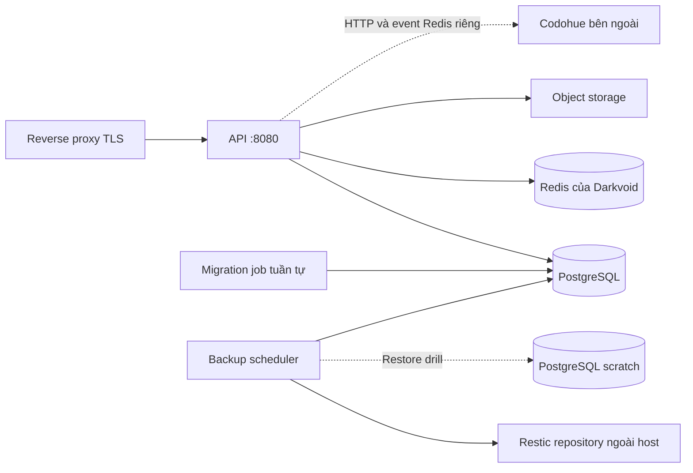

# Rà soát triển khai Docker và đề xuất refactor

Trạng thái: đề xuất đã được triển khai trong thay đổi refactor tiếp theo. Tài liệu
này giữ lại kết quả audit ban đầu; cấu hình và hướng dẫn vận hành hiện hành nằm ở
[container-deployment.md](container-deployment.md).

Ngày: 2026-09-09. Phạm vi: cấu hình trong repository, build image và kiểm tra
container cô lập trên máy phát triển. Chưa kiểm tra VPS, cấu hình reverse proxy,
GitHub environment protection thực tế hoặc dữ liệu backup trên remote.

Kết luận: tiếp tục dùng Docker Compose trên một host. Giữ hai image do dự án
build: ứng dụng và backup. Ưu tiên sửa tính nhất quán của deploy, cấu hình kết nối
và migration trước khi chia thêm image hoặc dịch vụ.

## Kiến trúc hiện tại

| Thành phần | Cách chạy hiện tại | Nhận xét |
| --- | --- | --- |
| API, seed, CLI | Một Dockerfile chứa ba binary; dev khai báo `build: .` riêng cho app, app-external, seed, ctl | Hợp lý khi cùng phiên bản; dev nên dùng chung tên image để tránh tool chạy image cũ |
| PostgreSQL, Redis | Hai service nội bộ, named volumes | Production khóa digest, không publish cổng DB/cache |
| Migration | Năm container nối tiếp: user → post → notification → bot-safe → settings | Thứ tự cần giữ; nhiều YAML lặp; SQL và script bind-mount từ host |
| Backup | Image riêng dựa trên PostgreSQL 16, Restic scheduler | Có backup ngoài host, retention, restore drill và cảnh báo |
| Codohue | Project ngoài; overlay nối network cho app và ctl | Ranh giới sở hữu đúng; alias DB/cache tránh trùng DNS giữa hai project |
| CD | CI thành công → build/push hai image → SCP cấu hình/SQL/script → SSH deploy → verify | Deploy đang nhắm GitHub environment `development`, dù dùng file tên `prod` |

Đã đọc cả hai Dockerfile, `.dockerignore`, ba Compose chính và override mẫu,
Makefile, `.env.example`, ba workflow, wrapper `dv`/`dvctl`, script ghi digest,
backup, migration và storage migration, các test vận hành cùng runbook liên quan.
Đối chiếu cấu hình listener, shutdown và `/health` với mã ứng dụng.

## Các vấn đề cần ưu tiên

Các mục dưới đây là phát hiện và đề xuất; thay đổi hiện tại chỉ sửa hai Dockerfile.

| Mức | Bằng chứng trong repo | Hệ quả và hướng sửa |
| --- | --- | --- |
| P1 | `docker-compose.yml` và `docker-compose.prod.yml`: publish `${SERVER_PORT}:8080`, healthcheck gọi 8080, nhưng `env_file: .env` truyền nguyên `SERVER_PORT`/`SERVER_HOST`; `pkg/config/load.go` dùng chúng cho listener | `.env` đặt `SERVER_PORT=9090` khiến app nghe 9090 trong container, còn Docker chuyển tới 8080. `SERVER_HOST=127.0.0.1` cũng chặn truy cập qua bridge. Cố định listener container thành `0.0.0.0:8080`; dùng biến host port riêng và cập nhật probe CD |
| P1 | `.github/workflows/cd.yml`: ghi digest vào `.env` sau `up -d`, trước step `Verify deployment` | App lỗi startup vẫn có thể trở thành bản được ghi nhận. Chỉ chốt release sau readiness; giữ manifest bản trước và báo rõ trạng thái nếu rollout thất bại. `up -d` không xác nhận app healthy |
| P1 | `.github/workflows/cd.yml`: không có concurrency/host lock; SCP đè cùng `/opt/darkvoid-dev` | Hai CI run thành công gần nhau có thể trộn SQL/script/Compose và image khác commit. Tuần tự hóa deploy theo environment, thêm host lock cho operator workflow, từ chối release cũ hơn bản đã triển khai |
| P1 | App/ctl nhận toàn bộ `.env`; cùng file được tài liệu hướng dẫn chứa `BACKUP_RESTIC_PASSWORD` và credentials backup | Container API nhận cả khóa giải mã backup nếu chúng nằm trong file này. Tách biến Compose/release, biến app và biến backup; chỉ inject giá trị cần thiết cho từng service |
| P2 | `scripts/dvctl` thêm Codohue nếu file tồn tại; `scripts/dv` và CD grep tên file trong toàn bộ `.env` | CD luôn SCP file Codohue, nên ctl có thể yêu cầu một network không tồn tại. Cách grep của dv/CD cũng khớp dòng comment trong `.env.example`. Dùng một entrypoint đọc đúng `COMPOSE_FILE`, tôn trọng override shell, không dùng `source .env`; ctl và CD gọi entrypoint đó |
| P2 | `docker-compose.yml`: `app` không có profile, `app-external` thuộc `external`, hai service publish cùng cổng | `COMPOSE_PROFILES=external docker compose up -d` vẫn khởi động cả stack mặc định và app-external. `make docker-up-app` đang đúng vì chỉ định service. Bỏ service app trùng lặp trong thiết kế mới; app-only là base Compose |
| P2 | Production pin digest của migrate image nhưng bind-mount `./migrations` và `./scripts/migrations`; CD SCP trực tiếp vào thư mục hiện hành | Khóa image chưa khóa toàn bộ release. Rollback hai digest không khôi phục SQL, script hay Compose. Gói chúng theo commit trong thư mục release bất biến; rollback app chỉ khi schema còn tương thích |
| P2 | `pg-backup` không có memory/CPU limit; restore drill mặc định dùng cùng PostgreSQL production | Dump, Restic prune và restore có thể tranh tài nguyên với API/DB. Đặt ngân sách tài nguyên dựa trên dữ liệu đo; ưu tiên PostgreSQL scratch cho restore drill khi dữ liệu lớn |
| P2 | CD cuối cùng `curl http://localhost:8080/health`, không kiểm tra sức khỏe pg-backup | Port publish tùy chỉnh làm verify sai; thiếu cấu hình backup vẫn có thể báo deploy thành công. Verify app theo cổng thực tế; production cần gate backup riêng với timeout phù hợp backup đầu tiên |
| P3 | Dev dùng tag nổi cho PostgreSQL/Redis/migrate và `restart: on-failure` không giới hạn cho migration | Dev có thể khác production; migration SQL lỗi lặp vô hạn. Đồng bộ version đã kiểm thử và dừng job migration ngay khi thất bại |

P1: có thể làm sai hoặc hỏng triển khai, hoặc mở rộng phạm vi truy cập credential.
P2: độ tin cậy và vận hành. P3: tính nhất quán môi trường.

Tái hiện bằng Compose config với `.env` giả, không dùng secrets thật:

```text
SERVER_PORT=9090, SERVER_HOST=127.0.0.1
app.ports              = host 9090 -> container 8080
app.environment        = SERVER_PORT=9090, SERVER_HOST=127.0.0.1
app.healthcheck        = http://localhost:8080/health

--profile external config
services               = app + app-external + postgres + redis + 5 migration jobs
app/app-external ports = cùng host 8080
```

Compose profile bổ sung các service được bật vào những service không gắn profile;
nó không chuyển sang một stack thay thế. Tham khảo
[Docker Compose profiles](https://docs.docker.com/compose/how-tos/profiles/).

## Kiến trúc đề xuất



Giữ API và background workers trong cùng tiến trình hiện tại. Một host có API,
PostgreSQL, Redis và backup là đủ cho mô hình triển khai đang có. Chỉ tách worker
khi có bằng chứng cần scale hoặc cô lập tài nguyên riêng.

Đề xuất bố cục Compose mới, thực hiện ở một thay đổi tiếp theo:

- `compose.yml`: app và ctl dùng cùng image; kết nối DB/Redis qua biến cấu hình,
  không sở hữu infrastructure. Đây cũng là chế độ app-only.
- `compose.dev.yml`: thêm PostgreSQL, Redis, migration, seed và build image local;
  app phụ thuộc migration thành công. API/tool dùng chung tên image local.
- `compose.prod.yml`: thêm PostgreSQL, Redis, migration, backup, giới hạn tài
  nguyên và cấu hình production; deploy từ digest. Sự lặp nhỏ của DB/Redis giữa
  dev/prod chấp nhận được để mỗi môi trường dễ đọc, tránh thêm nhiều tầng include.
- `compose.codohue.yml`: giữ overlay network tùy chọn và alias riêng; endpoint
  HTTP/event Redis được chỉ định rõ. Ưu tiên DNS alias ổn định do Codohue công bố
  khi hai project có thể phối hợp, thay vì `${CODOHUE_STACK}-redis-1`.

Một wrapper quyết định đầy đủ danh sách file, project name và release directory;
Makefile, CD và ctl dùng chung wrapper. Khi đổi tên/bố cục file phải giữ project
name, tên volume và network hiện tại, tránh Compose tạo DB/volume mới ngoài ý muốn.

Gộp năm migration service thành một job chạy tuần tự, dùng image migrate đã pin
và script nhỏ cùng SQL trong release bundle. Job dừng ngay khi một module lỗi.
Bot vẫn gọi `run-bot-safe.sh`, giữ trần 8 và chấp nhận DB đã ở 9. Luồng destructive
vẫn độc lập, có bảo vệ approval và bằng chứng backup/restore như hiện tại. Việc
gộp job không được gộp migration version table hoặc đổi thứ tự module.

Luồng release nên là:

```text
CI + build + smoke test image
  → bundle <commit>: Compose + SQL + scripts + app/backup digests
  → deploy lock + kiểm tra thứ tự release
  → pull image + xác thực cấu hình
  → migration job an toàn
  → khởi động app + chờ readiness có thời hạn
  → kiểm tra backup theo chính sách environment
  → ghi nhận release thành công
```

`docker compose up --wait --wait-timeout ...` có thể dùng để chờ service khỏe,
nhưng backup đầu tiên cần thời hạn riêng vì có thể mất nhiều phút. Xem
[Compose up](https://docs.docker.com/reference/cli/docker/compose/up/).
Concurrency theo environment tránh deploy chạy đồng thời; vẫn cần kiểm tra thứ
tự commit vì job đến hàng đợi không nhất thiết theo thứ tự release. Xem
[GitHub Actions concurrency](https://docs.github.com/en/actions/how-tos/write-workflows/choose-when-workflows-run/control-workflow-concurrency).

## Đơn giản hóa Dockerfile đã thực hiện

- App: một lệnh `go build` cho ba command, đổi tên `api` thành `darkvoid` để giữ
  entrypoint cũ; một lệnh COPY cho các binary. Thêm cache biên dịch BuildKit;
  giữ layer `go mod download` riêng. Bỏ git: dependency hiện tại tải và build được
  không cần công cụ VCS trong builder.
- Runtime app: bỏ gói wget riêng, dùng wget có sẵn trong BusyBox cho healthcheck
  HTTP. Giữ CA certificates, timezone data, Alpine digest và UID/GID `100:101`.
  Binary và `/app` thuộc root; chỉ `/app/uploads` thuộc user ứng dụng.
- Backup: giữ PostgreSQL base để client dump/restore khớp major của DB. Giữ
  bash/curl/jq/restic/CA/timezone là dependencies đang dùng; script thuộc root,
  chỉ cấp quyền sở hữu cho hai thư mục state cần ghi. Dockerfile này vốn đã ngắn,
  không có lợi ích rõ ràng khi thêm multi-stage hoặc thay base trong cùng thay đổi.

Cache mount tuân theo
[hướng dẫn Docker build cache](https://docs.docker.com/build/cache/optimize/).
Nó tăng khả năng tái sử dụng trên builder còn cache; CI runner mới vẫn cần cấu hình
external cache riêng. Không tuyên bố mức tăng tốc hoặc giảm dung lượng khi chưa
benchmark hai bản với cùng điều kiện.

Không đổi biến môi trường bắt buộc, migration SQL, Compose hay workflow trong
thay đổi này. Không thay UID/GID hoặc yêu cầu chown lại volume đang dùng.
`COPY . .` tiếp tục được bảo vệ bởi `.dockerignore`, trong đó loại `.env*`.

## Kiểm chứng

- `make test-ops` pass trước và sau sửa: backup, storage migration, deployment
  defaults, image pinning, migration gates, destructive policy và container user.
- Hai image build thành công từ Dockerfile mới: `darkvoid:docker-audit` và
  `darkvoid-backup:docker-audit`.
- Container app cô lập mạng: UID/GID đúng, uploads ghi được, `/app` và binary
  không ghi được, đủ ba executable, không chứa `/app/.env`, có CA và timezone;
  `seed --help` và `darkvoidctl --help` thành công.
- Wget mới được thử với HTTP 200 và 503 ở loopback trong container: nhận body ở
  200 và trả lỗi ở 503, phù hợp lệnh healthcheck Compose hiện tại.
- Container backup cô lập mạng, filesystem read-only và volume state tạm: chạy
  non-root, ghi được state/cache/tmp, script không ghi được; kiểm tra cú pháp bash
  và các executable PostgreSQL 16.14, Restic, curl, jq đều thành công.
- Compose config hợp lệ cho dev, external, tools, override cổng local và
  production + Codohue + destructive profile; chỉ render cấu hình, không chạy
  destructive migration. Các trường nhạy cảm không được in ra.
- Chưa chạy rollout thực tế, backup remote hoặc restore drill thật. Đây là kiểm
  chứng build và cấu hình, không chứng nhận production đã sẵn sàng.

## Thứ tự triển khai tiếp theo

1. Sửa listener/host port, thống nhất wrapper và giới hạn env inject. Thêm test
   cấu hình đã render cho port khác mặc định, `.env` có comment và Codohue tắt/bật.
2. Sửa CD: lock, release bundle theo commit, readiness trước khi chốt digest,
   kiểm tra backup và smoke test image trước deploy.
3. Gộp migration job và tổ chức lại Compose; kiểm tra DB mới, DB hiện có,
   migration thất bại, bot ở 8/9 và app-only. Giữ tên volume/project khi chuyển.
4. Đo tải backup/restore, bổ sung ngân sách tài nguyên và scratch DB khi cần;
   thêm external build cache cho CI nếu thời gian build đáng kể.
